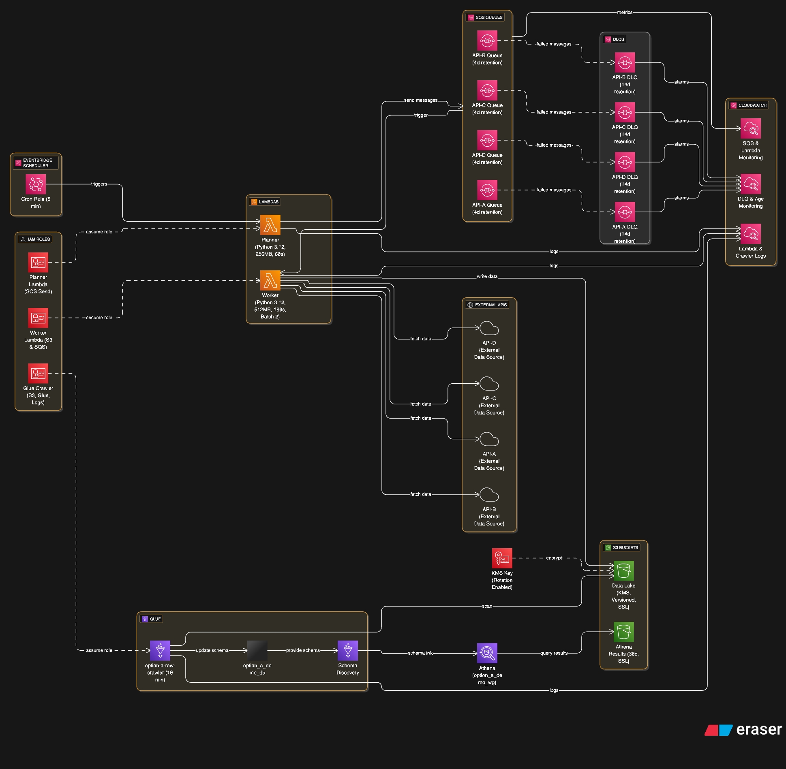

# Demo of Data Lake Option A

## How to use

1. unzip & set up a venv:

   ```bash
   cd option_a_cdk_py
   python -m venv .venv
   source .venv/bin/activate   # on Windows: .venv\Scripts\activate
   pip install -r requirements.txt
   ```

2. deploy:

   ```bash
   cdk bootstrap
   cdk deploy
   ```

3. kick off a run (or wait for the cron at 01:00 UTC):

   ```bash
   aws lambda invoke --function-name <PlannerFunctionName> /dev/stdout
   ```

   You’ll see objects under:

   ```
   s3://<DataLakeBucket>/raw/source=api-a/ingestion_date=<today>/
   ```

4. run the Glue crawler (or wait for its schedule), then query in Athena using the created WorkGroup.

## 1. Confirm the catalog object exist

In the AWS console:

Athena → Workgroup: switch to the workgroup the CDK created (default in the demo: option_a_demo_wg).

Query editor: pick the database (demo default: option_a_demo_db).

In the left sidebar, you should see a table the crawler created from s3://<data-lake>/raw/…. If you don’t know the exact name yet, you can find it with:

```sql
SHOW TABLES IN option_a_demo_db;
```

If no table shows up, start (or rerun) the Glue Crawler and wait for it to finish successfully.

## 2. (if needed) load partitions

The demo writes to Hive-style paths like:

```bash
raw/source=api-a/ingestion_date=YYYY-MM-DD/page=000001.json.gz
```

Glue usually adds these partitions automatically. If you see data files in S3 but no partitions in the table, run:

```sql
MSCK REPAIR TABLE "<your_table_name>";
```

Then confirm:

```sql
SHOW PARTITIONS "<your_table_name>";
```

## 3. Quick “did anything land?” smoke test

```sql
SELECT
  source,
  ingestion_date,
  COUNT(*)            AS files
FROM "<option_a_demo_db>"."<your_table_name>"
GROUP BY 1,2
ORDER BY ingestion_date DESC, source;
```

You should see 4 rows for today (one per endpoint) if you ran the planner once, with ~10 files per endpoint (the demo enqueues 10 “pages” each).

## 4. Sample a few rows to inspect shape

```sql
SELECT
  source,
  ingestion_date,
  page,
  cardinality(items)  AS items_in_page,
  endpoint,
  date,
  fetched_at
FROM "<option_a_demo_db>"."<your_table_name>"
WHERE ingestion_date = date_format(current_date, '%Y-%m-%d')
ORDER BY source, page
LIMIT 20;
```

## 5. Notes

The demo’s JSON has fields: endpoint, date, page, fetched_at, and an array items with 5 objects per page.

If the crawler inferred items as array<struct<id:string,value:bigint>>, cardinality(items) will work.

# Option A

EventBridge → SQS → Lambda → S3 (serverless & simple)

## Architecture (high level)



[EventBridge (cron)]
        │
        ▼
[Planner Lambda] ──► [SQS api-a] ─┐
        │                         ├─► [Lambda Worker(s)] ─► [S3 Data Lake (raw/...)]
        ├──────────────────────► [SQS api-b] ─┘
        ├──────────────────────► [SQS api-c]
        └──────────────────────► [SQS api-d]

[S3 Data Lake]
  ├─ raw/source=apiX/ingestion_date=YYYY-MM-DD/...
  └─ curated/... (optional downstream jobs later)

[Glue Crawler] → [Glue Data Catalog Tables] → [Athena SQL]

[CloudWatch]
  ├─ Logs (Planner/Workers)
  ├─ Metrics (custom: pages_ingested, failures, DLQ depth)
  └─ Alarms & Dashboard (error rate, throttles, age-of-oldest-message)

[CloudTrail + KMS + IAM boundaries]

## Data flow

EventBridge runs on your cadence (e.g., hourly/daily) and triggers Planner Lambda.

Planner Lambda enumerates work (endpoints × date shards × pages) and publishes messages to SQS (one queue per endpoint).

Lambda workers (SQS event source) pull messages, call the external API (with backoff on 429/5xx), and write gzip JSON/Parquet to S3 under:

s3://lake/raw/source={endpoint}/ingestion_date={YYYY-MM-DD}/page={N}.json.gz

Glue Crawler runs on a schedule (e.g., after each batch) to discover/update table schemas in the Glue Data Catalog.

Analysts (or jobs) query with Athena over the cataloged tables/partitions.

## Key design choices

Idempotency: deterministic S3 keys per (endpoint, date, page); optional object metadata with content hash.

Partitions: at minimum source, ingestion_date. (Add year/month/day subfolders if you expect large volumes.)

Back-pressure: SQS controls concurrency; set Lambda reserved concurrency per queue to respect vendor QPS.

Retries: SQS redrive + Lambda code backoff. Use DLQs on each SQS for poison messages.

Schema evolution: Glue Crawler infers; pin column types by promoting curated Parquet later if needed.

## Cloud (ops, security, cost)

### CloudWatch Logs/Metrics/Alarms

Logs from Planner/Workers.

Custom metrics: pages_ingested_total, failures_total, api_latency_ms.

Alarms: worker error rate > threshold, DLQ > 0, SQS “age of oldest message”, Lambda throttles.

CloudTrail for API auditing; KMS for S3 bucket encryption and SQS SSE; VPC endpoints for S3/SQS (no public egress).

Cost levers: Keep payloads gzipped; prefer Parquet if you’ll query often; right-size Lambda memory; control Glue Crawler scope (point it to raw/source=.../ingestion_date=...).

### IAM (principals & least privilege)

Planner Lambda role: sqs:SendMessage to the 4 queues.

Worker Lambda role: sqs:Receive/Delete, s3:PutObject to raw/, kms:Encrypt/Decrypt if enabled.

Glue/Athena role: read from S3 data lake paths; write query results to a separate athena-results bucket/prefix.

# Option B

EventBridge → ECS Fargate Scheduled Task → S3 (single container, longer tasks)

## Architecture (high level)

[EventBridge (cron)] ─► [ECS Fargate Scheduled Task: "ingestor" container]
                                 │
                                 ├─ Parallel HTTP pulls (threads/async/greenlets)
                                 └─ Writes to S3: raw/source=apiX/ingestion_date=.../*.json.gz

[S3 Data Lake]
  ├─ raw/source=apiX/ingestion_date=YYYY-MM-DD/...
  └─ curated/... (optional)

[Glue Crawler] → [Glue Data Catalog Tables] → [Athena SQL]

[CloudWatch]
  ├─ Logs (task stdout/stderr)
  ├─ Metrics (via PutMetricData: pages_ingested, failures)
  └─ Alarms (task failed, 0 files written, error rate)
  
[CloudTrail + KMS + IAM boundaries]

## Data flow

EventBridge triggers the Fargate Scheduled Task (1–N tasks per run).

The containerized ingestor fetches from the 4 APIs in parallel (your code handles pagination, backoff, retries).

The task writes objects to S3 with the same partitioning/idempotency scheme as Option A.

Glue Crawler schedules after task completion (offset a few minutes) and updates Glue Catalog for Athena queries.

## Key design choices

Orchestration in code: One codebase handles listing pages, rate limiting, retries, and idempotent S3 writes.

Scaling: Typically 1 task per batch; if needed, shard by date or endpoint and run multiple tasks.

Long-running work: Fargate avoids Lambda’s 15-minute limit and is great if you need custom libs (e.g., native deps).

## Cloud (ops, security, cost)

### CloudWatch Logs: container logs via log driver

CloudWatch Alarms: on ECS task failures, zero written objects, or high error counts (emit metrics from the app).

Networking: run in private subnets; use VPC endpoints for S3; if calling public APIs, attach a NAT or VPC-Lattice/egress proxy as required.

Security: S3 + SQS (if used) with KMS; task role limited to S3 PutObject in raw/.

Cost levers: Right-size CPU/memory; prefer Parquet for heavy Athena users; narrow Glue Crawler scope.

### Glue, Athena, and Data Layout (both options)

S3 layout (recommended)
s3://<lake-bucket>/
  raw/
    source=api-a/ingestion_date=YYYY-MM-DD/part-00000.json.gz
    source=api-b/ingestion_date=YYYY-MM-DD/...
  curated/   (optional: Parquet, cleansed, join-ready)
Glue Crawler
Scope: point at raw/ or per-source prefix to control runtime.

Schedule: after each batch (e.g., +10 min) or hourly.

Schema stability: If APIs change often, consider an ETL step to curated/ in Parquet with explicit schemas and partition columns; run a second crawler on curated.

Athena
Tables: one per source (or single external table with a source partition).

Partitions: add ingestion_date as a partition column for efficient pruning.

Results: set query results bucket/prefix (e.g., s3://<lake>-athena-results/).

Views: create views that union latest N days or normalize fields across APIs.

Rate limiting, retries, and idempotency (both options)
Per-endpoint concurrency caps:

Option A: Lambda reserved concurrency per queue.

Option B: thread pool size per endpoint.

Backoff policy: exponential backoff + jitter on 429/5xx; circuit-break after N attempts and log to “failures.”

Idempotent writes: deterministic keys; optionally check object existence or store a content hash to avoid duplicates.

### Monitoring & Alerts (both options)

Dashboards (CloudWatch):

Total pages/files ingested per run

Error rate / retries

DLQ depth (Option A)

ECS task success rate (Option B)

Alarms:

errors > X in 5–15 min window

DLQ > 0 (Option A)

AgeOfOldestMessage > threshold (Option A)

ECS Task Failed (Option B)

Glue Crawler failed runs

Minimal IaC outline (AWS CDK examples to aim for)
Common

S3.Bucket(lake, encryption=KMS, bucketKeyEnabled=True)

Glue.Database, Glue.Crawler (targets lake prefixes)

Athena.WorkGroup + results bucket

VPC + endpoints for S3, CloudWatch Logs; (Option B) ECS cluster

Option A

events.Rule(schedule=cron) → Planner Lambda

4× sqs.Queue (+ DLQ), lambda.Function workers with SQS event sources

IAM statements as listed above

Option B

events.Rule(schedule=cron) → EcsScheduledTask (Fargate)

TaskDefinition with execution/task roles for S3 PutObject

LogGroup + metric filters

## Choosing between A and B (quick guide)

Go with Option A if you want the most “AWS-managed” parallelism, dead-letter queues, and tiny units of work with minimal ops.

Go with Option B if your team prefers “one container that does everything,” needs long tasks or native deps, and wants all logic in a single repo.
